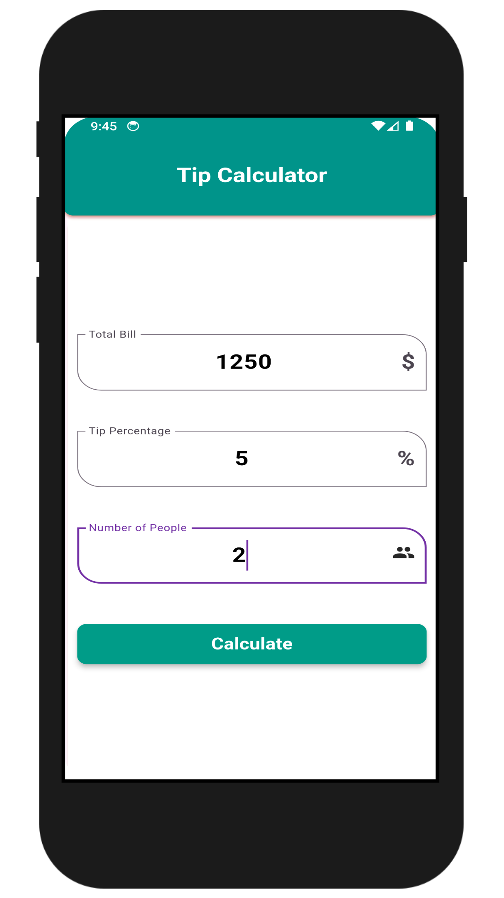

# 💸 Tip Calculator

**A Flutter-based Tip Calculator App** A simple and efficient Tip Calculator app built with Flutter. This app helps users easily calculate tips based on the total bill amount, and split the tip amount between multiple people. Perfect for dining out or group activities!


---

## 📋 Features

- **Bill Amount Input:**  
  Enter the total bill amount to calculate the tip.

- **Tip Percentage Options:**  
  Enter a custom percentage.

- **Split the Tip:**  
  Option to divide the total tip and bill amount among multiple people.

- **Total Amount Calculation:**  
  Displays the total amount per person including the bill and tip.

- **Responsive Design**  
  Optimized for both mobile and tablet screens.


---

## 🚀 Installation

1. **Clone the Repository:**
   ```bash
   git clone https://github.com/rabby220/Tip-Calculator.git
   cd Tip-Calculator

2. **Install Dependencies::**
   ```bash
   flutter pub get

3. **Install Dependencies::**
   ```bash
   flutter run

---

## 🛠️ Tech Stack
- Flutter (Dart): For building a cross-platform app for Android and iOS.
- State Management: GetX for managing state and reactivity.
- UI Components: Material Design widgets for modern and responsive UI.

---

## 📸 Screenshots


<p align="center">
  
  
  
</p>


---

## 💡 How It Works

1. Input Bill Amount: <br>
   Enter the total bill amount (e.g., $50).</p>

2. Select Tip Percentage: <br>
   Enter a custom value.

3. Calculate Tip:<br>
   The app will automatically calculate the tip and the total amount including the tip.

4. Split Between People:<br>
   Choose the number of people to split the bill and tip.

5. Result:<br>
   The app displays the total amount per person.


---

## 💡 How to Contribute

1. Fork the repository.
2. Create a new branch:
   ```bash
   git checkout -b feature-name

3. Commit your changes:
   ```bash
   git commit -m "Add some feature"

4. Push to the branch:
   ```bash
   git push origin feature-name

5. Open a Pull Request.

## 📫 Contact
If you have any questions or suggestions, feel free to reach out via [Email](mailto:fajlarabby220@gmail.com).